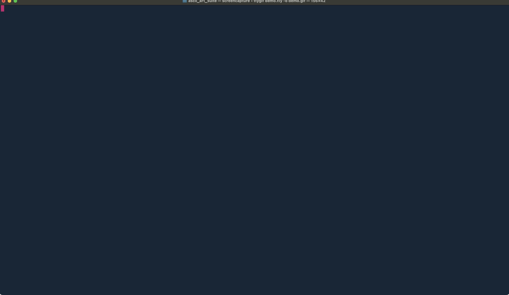

# ASCII Art Suite 💼

This is a toy implementation of a simple file format used for ASCII art.

The repository contains 2 applications, 1 ASCII Art generator and 1 ASCII Art viewer.

## Header Format 📨

The file format (.aart) is built as follows.

| Offset | Size  | Description                                        |
|----------|--------|-----------------------------------------------------|
| 0        | 4 Bytes | The character sequence „aart“ to specify valid header files |
| 4        | 1      | Number of rows                                   |
| 8        | 1      | Number of columns                                  |
| 12       | n Bytes | Rows * Columns of encoded ASCII payload data                     |

## Applications

### ASCII Art generator 📟

This tool uses the "stb_image.h" header to create the ASCII art of any given image. The tool supports scaling of the ASCII art to allow for small/large ASCII art.
The generator encodes the payload of the ASCII art by only toggling all bits of a byte, when the _"#"_ is hit.

Currently, the character used for the ASCII art is the _"#"_ character. 

There are plans to update the file type to support other characters, too.

### ASCII Art viewer 📺

This tool is used to view the generated ASCII art. It reads a given _.aart_ file and decodes the payload to view the embedded ASCII art.

## Development & Compilation 🛠️

Check out the repo:

```bash
git clone git@github.com:hackmac89/ascii_art_suite.git
```

Use the given Makefile in the projects root directory, to compile the suite by typing:

```bash
make
```

See `make help` for the remaining Makefile targets (Docker building etc.)

```bash
Usage:

  make                          - Builds both ASCII art generator and viewer
  make clean                    - Removes compiled files
  make -C generator             - Builds only the generator
  make -C viewer                - Builds only the viewer
  make docker-build-generator   - Builds the docker image for the ASCII art generator
  make docker-build-viewer      - Builds the docker image for the ASCII art viewer
  make help                     - Shows this message
```

## Demo time 💿

Here, we just use an arbitrary example image and convert it into an _aart_ file, display its hex contents and display it back in the ASCII art viewer application.



## FAQ 🤷🏻‍♂️

> Why using a submodule to include the external "stb_image.h" header, instead of using cURL/wget when building?

I did not want to check in the several thousand line long header file and I always wanted to use a submodule in one of my repos, so why not? Furthermore, I only pull the versioned "stb_image.h" version instead of pulling the whole STB library.

> ...

## TODO 🔨

- Finalize valgrind integration

## Future plans 🗒️

- Add header bitfield used for flags for future updates, e.g. flags for additional options (checksums, additional ASCII mapping etc. pp.)

## Thanks to 🙏

- [STB library](https://github.com/nothings/stb)
